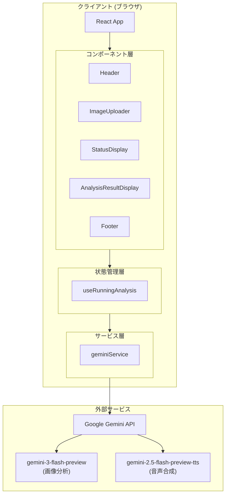
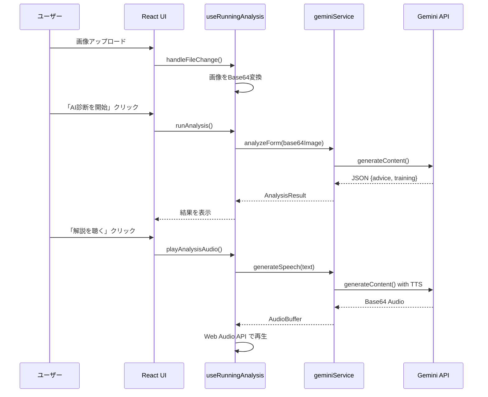
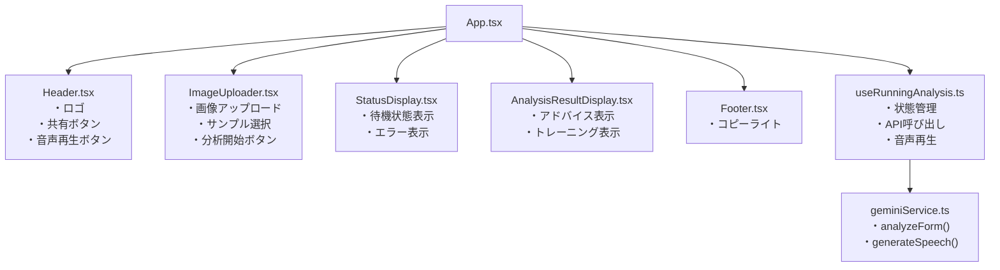
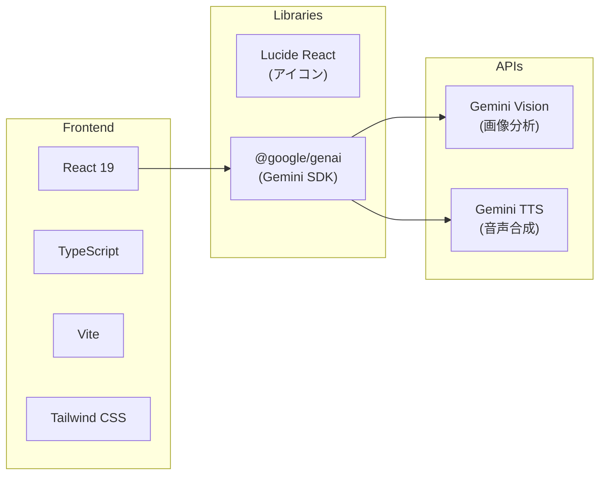

# アーキテクチャ

## システム構成図

```mermaid
flowchart TB
    subgraph Client["クライアント (ブラウザ)"]
        UI[React App]

        subgraph Components["コンポーネント層"]
            Header
            ImageUploader
            StatusDisplay
            AnalysisResultDisplay
            Footer
        end

        subgraph Hooks["状態管理層"]
            useRunningAnalysis
        end

        subgraph Services["サービス層"]
            geminiService
        end
    end

    subgraph External["外部サービス"]
        GeminiAPI["Google Gemini API"]
        GeminiFlash["gemini-3-flash-preview<br/>(画像分析)"]
        GeminiTTS["gemini-2.5-flash-preview-tts<br/>(音声合成)"]
    end

    UI --> Components
    Components --> Hooks
    Hooks --> Services
    Services --> GeminiAPI
    GeminiAPI --> GeminiFlash
    GeminiAPI --> GeminiTTS
```

## データフロー

```mermaid
sequenceDiagram
    participant User as ユーザー
    participant UI as React UI
    participant Hook as useRunningAnalysis
    participant Service as geminiService
    participant API as Gemini API

    User->>UI: 画像アップロード
    UI->>Hook: handleFileChange()
    Hook->>Hook: 画像をBase64変換

    User->>UI: 「AI診断を開始」クリック
    UI->>Hook: runAnalysis()
    Hook->>Service: analyzeForm(base64Image)
    Service->>API: generateContent()
    API-->>Service: JSON {advice, training}
    Service-->>Hook: AnalysisResult
    Hook-->>UI: 結果を表示

    User->>UI: 「解説を聴く」クリック
    UI->>Hook: playAnalysisAudio()
    Hook->>Service: generateSpeech(text)
    Service->>API: generateContent() with TTS
    API-->>Service: Base64 Audio
    Service-->>Hook: AudioBuffer
    Hook->>Hook: Web Audio API で再生
```

## コンポーネント構成

```mermaid
graph TD
    App["App.tsx"]

    App --> Header["Header.tsx<br/>・ロゴ<br/>・共有ボタン<br/>・音声再生ボタン"]
    App --> ImageUploader["ImageUploader.tsx<br/>・画像アップロード<br/>・サンプル選択<br/>・分析開始ボタン"]
    App --> StatusDisplay["StatusDisplay.tsx<br/>・待機状態表示<br/>・エラー表示"]
    App --> AnalysisResultDisplay["AnalysisResultDisplay.tsx<br/>・アドバイス表示<br/>・トレーニング表示"]
    App --> Footer["Footer.tsx<br/>・コピーライト"]

    App --> useRunningAnalysis["useRunningAnalysis.ts<br/>・状態管理<br/>・API呼び出し<br/>・音声再生"]

    useRunningAnalysis --> geminiService["geminiService.ts<br/>・analyzeForm()<br/>・generateSpeech()"]
```

## 技術スタック

```mermaid
graph LR
    subgraph Frontend
        React["React 19"]
        TS["TypeScript"]
        Vite["Vite"]
        Tailwind["Tailwind CSS"]
    end

    subgraph Libraries
        Lucide["Lucide React<br/>(アイコン)"]
        GenAI["@google/genai<br/>(Gemini SDK)"]
    end

    subgraph APIs
        Vision["Gemini Vision<br/>(画像分析)"]
        TTS["Gemini TTS<br/>(音声合成)"]
    end

    React --> GenAI
    GenAI --> Vision
    GenAI --> TTS
```
